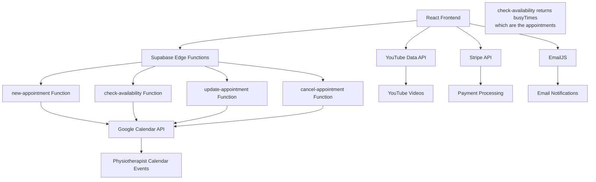

# Design Document

## Overview

The online physiotherapy platform is designed as a modern, responsive web application built with React, TypeScript, and Vite. The architecture leverages free cloud services to minimize costs while providing a robust foundation for the MVP. The platform focuses on appointment booking with integrated donation options, patient assessment, educational content, and donation management. All appointment data is stored directly in Google Calendar events, eliminating the need for a separate appointment database.

## Architecture

### Technology Stack

**Frontend:**
- React 18 with TypeScript
- Vite for build tooling and development server
- Tailwind CSS for styling and responsive design
- React Router for client-side routing
- React Hook Form for form management
- React Query (TanStack Query) for data fetching and caching

**Backend & Services:**
- **Supabase Edge Functions** - Serverless functions for Google Calendar API integration (Deno + TypeScript)
- **Google Calendar API** - Primary data storage for appointments and availability management via Edge Functions
- **YouTube Data API v3** - Video metadata and embedding
- **Stripe** - Payment processing for donations (free tier available)
- **EmailJS** - Free email service for donation confirmations (up to 200 emails/month)
- **Vercel** - Free frontend hosting and deployment

**Key Integrations:**
- Google OAuth 2.0 for Calendar API access (server-side only)
- Google Meet API for automatic video conference link generation
- Stripe Elements for secure payment processing (integrated into booking flow)
- YouTube iframe API for video embedding
- EmailJS for donation confirmation emails

### System Architecture Diagram



## Components and Interfaces

### Core Components Structure

```
src/
├── components/
│   ├── common/
│   │   ├── Header.tsx
│   │   ├── Footer.tsx
│   │   ├── LoadingSpinner.tsx
│   │   └── ErrorBoundary.tsx
│   ├── booking/
│   │   ├── CalendarView.tsx
│   │   ├── TimeSlotPicker.tsx
│   │   ├── SymptomAssessmentForm.tsx
│   │   └── BookingConfirmation.tsx
│   ├── exercises/
│   │   ├── VideoLibrary.tsx
│   │   ├── CategoryFilter.tsx
│   │   ├── VideoCard.tsx
│   │   └── VideoPlayer.tsx
│   ├── donations/
│   │   ├── DonationForm.tsx
│   │   ├── PaymentProcessor.tsx
│   │   └── DonationProgress.tsx
│   └── admin/
│       ├── AppointmentManager.tsx
│       ├── VideoManager.tsx
│       └── CalendarSync.tsx
├── hooks/
│   ├── useCalendar.ts
│   ├── useBooking.ts
│   ├── useVideos.ts
│   └── useDonations.ts
├── services/
│   ├── supabase.ts
│   ├── googleCalendar.ts
│   ├── youtube.ts
│   ├── stripe.ts
│   └── email.ts
├── types/
│   ├── appointment.ts
│   ├── assessment.ts
│   ├── video.ts
│   └── donation.ts
└── utils/
    ├── dateHelpers.ts
    ├── validation.ts
    └── constants.ts
```

### Supabase Edge Functions Architecture

**Google Calendar Integration via Edge Functions:**

The platform uses Supabase Edge Functions (Deno + TypeScript) to handle Google Calendar API operations securely. This approach keeps sensitive credentials server-side and provides a clean API interface for the frontend.

**Edge Function Structure:**
```
supabase/functions/
├── new-appointment/
│   └── index.ts
├── check-availability/
│   └── index.ts (also returns appointment details in busyTimes)
├── update-appointment/
│   └── index.ts
├── cancel-appointment/
│   └── index.ts
└── _shared/
    ├── google-auth.ts
    ├── calendar-utils.ts
    └── types.ts
```

**Key Edge Function Interfaces:**

```typescript
// new-appointment function request/response
interface NewAppointmentRequest {
  startTime: string; // ISO 8601 format
  endTime: string;   // ISO 8601 format
  patientName: string;
  patientEmail: string;
  symptomAssessment: SymptomAssessmentData;
}

interface NewAppointmentResponse {
  success: boolean;
  eventId?: string;
  appointmentDetails?: AppointmentData;
  error?: string;
}

// check-availability function request/response (also serves as get-appointments)
interface CheckAvailabilityRequest {
  start: string; // ISO 8601 format
  end: string;   // ISO 8601 format
}

interface CheckAvailabilityResponse {
  available: boolean;
  busyTimes?: Array<{
    start: string;
    end: string;
    eventId?: string; // Google Calendar event ID
    summary?: string; // Event title
    appointmentData?: AppointmentMetadata; // Parsed from event description
  }>;
  error?: string;
}

// update-appointment function request/response
interface UpdateAppointmentRequest {
  eventId: string;
  startTime?: string;
  endTime?: string;
  patientName?: string;
  patientEmail?: string;
  symptomAssessment?: SymptomAssessmentData;
}

interface UpdateAppointmentResponse {
  success: boolean;
  appointmentDetails?: AppointmentData;
  error?: string;
}

// cancel-appointment function request/response
interface CancelAppointmentRequest {
  eventId: string;
}

interface CancelAppointmentResponse {
  success: boolean;
  error?: string;
}

// Google Calendar API interfaces
interface GoogleCalendarEvent {
  id?: string;
  summary: string;
  description?: string;
  start: {
    dateTime: string;
    timeZone: string;
  };
  end: {
    dateTime: string;
    timeZone: string;
  };
  conferenceData?: {
    createRequest: {
      requestId: string;
      conferenceSolutionKey: {
        type: 'hangoutsMeet';
      };
    };
  };
}

interface GoogleTokenResponse {
  access_token: string;
  expires_in: number;
  token_type: string;
}
```

**Environment Variables for Edge Functions:**
- `GOOGLE_CLIENT_ID` - OAuth 2.0 client ID
- `GOOGLE_CLIENT_SECRET` - OAuth 2.0 client secret  
- `GOOGLE_REFRESH_TOKEN` - Long-lived refresh token for the physiotherapist's calendar

### Key Interfaces

```typescript
// Appointment Management (stored in Google Calendar events)
interface AppointmentData {
  eventId: string; // Google Calendar event ID
  patientName: string;
  patientEmail: string;
  startTime: string; // ISO 8601 format
  endTime: string;   // ISO 8601 format
  status: 'scheduled' | 'completed' | 'cancelled';
  symptomAssessment: SymptomAssessmentData;
  meetLink?: string; // Google Meet link for remote session
  createdAt: string; // ISO 8601 format
}

interface SymptomAssessmentData {
  painLevel: number; // 1-10 scale
  painLocation: string[];
  symptomDuration: string;
  previousTreatments: string;
  currentMedications: string;
  additionalNotes: string;
}

// Exercise Video Management
interface ExerciseVideo {
  id: string;
  youtubeId: string;
  title: string;
  description: string;
  category: VideoCategory;
  difficulty: 'beginner' | 'intermediate' | 'advanced';
  duration: number;
  equipmentRequired: string[];
  bodyParts: string[];
  isActive: boolean;
}

interface VideoCategory {
  id: string;
  name: string;
  description: string;
  icon: string;
}

// Donation System
interface Donation {
  id: string;
  donorName?: string;
  donorEmail?: string;
  amount: number;
  currency: string;
  message?: string;
  isAnonymous: boolean;
  stripePaymentId: string;
  status: 'pending' | 'completed' | 'failed';
  createdAt: Date;
}
```

## Data Models

### Google Calendar Event Structure

Appointments are stored as Google Calendar events with structured data in the event description. The event description contains JSON-formatted appointment and symptom assessment data.

```typescript
// Google Calendar Event structure for appointments
interface CalendarEventData {
  summary: string; // "Physiotherapy Appointment - [Patient Name]"
  description: string; // JSON string containing AppointmentMetadata
  start: {
    dateTime: string; // ISO 8601 format
    timeZone: string;
  };
  end: {
    dateTime: string; // ISO 8601 format
    timeZone: string;
  };
  attendees?: Array<{
    email: string;
    displayName?: string;
  }>;
  conferenceData?: {
    createRequest: {
      requestId: string;
      conferenceSolutionKey: {
        type: 'hangoutsMeet';
      };
    };
  };
  hangoutLink?: string; // Generated Google Meet link
}

// Metadata stored in event description as JSON
interface AppointmentMetadata {
  patientName: string;
  patientEmail: string;
  status: 'scheduled' | 'completed' | 'cancelled';
  symptomAssessment: SymptomAssessmentData;
  meetLink?: string; // Google Meet link for remote session
  createdAt: string; // ISO 8601 format
  bookingSource: 'web-platform';
}
```

### Local Storage for Exercise Videos and Donations

Since appointments are now stored in Google Calendar, we only need minimal database storage for exercise videos and donations:

```sql
-- Exercise videos table (simplified)
CREATE TABLE exercise_videos (
  id UUID PRIMARY KEY DEFAULT gen_random_uuid(),
  youtube_id VARCHAR(255) NOT NULL UNIQUE,
  title VARCHAR(500) NOT NULL,
  description TEXT,
  category VARCHAR(100) NOT NULL,
  difficulty VARCHAR(20) DEFAULT 'beginner',
  duration INTEGER,
  equipment_required TEXT[],
  body_parts TEXT[],
  is_active BOOLEAN DEFAULT true,
  created_at TIMESTAMPTZ DEFAULT NOW()
);

-- Donations table
CREATE TABLE donations (
  id UUID PRIMARY KEY DEFAULT gen_random_uuid(),
  donor_name VARCHAR(255),
  donor_email VARCHAR(255),
  amount DECIMAL(10,2) NOT NULL,
  currency VARCHAR(3) DEFAULT 'USD',
  message TEXT,
  is_anonymous BOOLEAN DEFAULT false,
  stripe_payment_id VARCHAR(255) NOT NULL,
  status VARCHAR(20) DEFAULT 'pending',
  created_at TIMESTAMPTZ DEFAULT NOW()
);

-- Video categories table
CREATE TABLE video_categories (
  id UUID PRIMARY KEY DEFAULT gen_random_uuid(),
  name VARCHAR(100) NOT NULL UNIQUE,
  description TEXT,
  icon VARCHAR(100),
  created_at TIMESTAMPTZ DEFAULT NOW()
);
```

### Row Level Security (RLS) Policies

```sql
-- Enable RLS on remaining tables
ALTER TABLE exercise_videos ENABLE ROW LEVEL SECURITY;
ALTER TABLE donations ENABLE ROW LEVEL SECURITY;
ALTER TABLE video_categories ENABLE ROW LEVEL SECURITY;

-- Public read access for exercise videos
CREATE POLICY "Exercise videos are viewable by everyone" ON exercise_videos
  FOR SELECT USING (is_active = true);

-- Admin-only write access for videos
CREATE POLICY "Only admin can manage videos" ON exercise_videos
  FOR ALL USING (auth.jwt() ->> 'role' = 'admin');

-- Public read access for video categories
CREATE POLICY "Video categories are viewable by everyone" ON video_categories
  FOR SELECT USING (true);
```

## Error Handling

### Frontend Error Handling Strategy

```typescript
// Global error boundary for React components
class ErrorBoundary extends React.Component {
  // Handle React component errors
}

// API error handling with React Query
const useAppointments = () => {
  return useQuery({
    queryKey: ['appointments'],
    queryFn: fetchAppointments,
    retry: 3,
    retryDelay: attemptIndex => Math.min(1000 * 2 ** attemptIndex, 30000),
    onError: (error) => {
      toast.error('Failed to load appointments. Please try again.');
      console.error('Appointments fetch error:', error);
    }
  });
};

// Form validation with React Hook Form
const bookingSchema = yup.object({
  patientName: yup.string().required('Name is required'),
  patientEmail: yup.string().email('Invalid email').required('Email is required'),
  appointmentDate: yup.date().min(new Date(), 'Date must be in the future').required()
});
```

### Backend Error Handling

```typescript
// Google Calendar API error handling
const handleCalendarError = (error: any) => {
  if (error.status === 401) {
    throw new Error('Calendar access expired. Please reconnect.');
  }
  if (error.status === 403) {
    throw new Error('Insufficient calendar permissions');
  }
  if (error.status === 404) {
    throw new Error('Appointment not found in calendar');
  }
  if (error.status === 409) {
    throw new Error('Calendar conflict - time slot may be unavailable');
  }
  throw new Error('Calendar operation failed');
};

// Edge Function error handling
const handleEdgeFunctionError = (error: any) => {
  if (error.message?.includes('token')) {
    throw new Error('Authentication failed. Please try again.');
  }
  if (error.message?.includes('availability')) {
    throw new Error('Unable to check availability. Please try again.');
  }
  throw new Error('Service temporarily unavailable');
};
```

## Testing Strategy

### Testing Approach

**Unit Testing:**
- Vitest for unit tests
- React Testing Library for component testing
- Mock Service Worker (MSW) for API mocking

**Integration Testing:**
- Test API integrations with actual services in staging
- End-to-end user flows with Playwright

**Key Test Scenarios:**
1. Appointment booking flow with calendar sync
2. Symptom assessment form validation
3. Payment processing with Stripe
4. Video library filtering and search
5. Email notification delivery
6. Mobile responsiveness across devices

### Test Structure

```typescript
// Example component test
describe('BookingForm', () => {
  it('should validate required fields', async () => {
    render(<BookingForm />);
    
    const submitButton = screen.getByRole('button', { name: /book appointment/i });
    fireEvent.click(submitButton);
    
    expect(await screen.findByText('Name is required')).toBeInTheDocument();
    expect(await screen.findByText('Email is required')).toBeInTheDocument();
  });

  it('should sync with Google Calendar on successful booking', async () => {
    const mockCalendarSync = jest.fn();
    jest.mock('../services/googleCalendar', () => ({
      createCalendarEvent: mockCalendarSync
    }));

    render(<BookingForm />);
    
    // Fill form and submit
    // Assert calendar sync was called
    expect(mockCalendarSync).toHaveBeenCalledWith(expectedEventData);
  });
});
```

## Deployment and Infrastructure

### Free Tier Deployment Strategy

**Frontend Deployment (Vercel):**
- Automatic deployments from Git repository
- Custom domain support
- Edge caching and CDN
- Environment variable management

**Backend Services:**
- **Supabase Edge Functions**: Free tier includes 500,000 function invocations/month
- **Google Calendar API**: Free quota of 1,000,000 requests/day
- **YouTube Data API**: Free quota of 10,000 units/day
- **Stripe**: No monthly fees, 2.9% + 30¢ per transaction
- **EmailJS**: Free tier with 200 emails/month

### Environment Configuration

```typescript
// Environment variables
interface Config {
  VITE_SUPABASE_URL: string;
  VITE_SUPABASE_ANON_KEY: string;
  VITE_YOUTUBE_API_KEY: string;
  VITE_STRIPE_PUBLISHABLE_KEY: string;
  VITE_EMAILJS_SERVICE_ID: string;
  VITE_EMAILJS_TEMPLATE_ID: string;
  VITE_EMAILJS_PUBLIC_KEY: string;
}

// Edge Function environment variables
interface EdgeFunctionConfig {
  GOOGLE_CLIENT_ID: string;
  GOOGLE_CLIENT_SECRET: string;
  GOOGLE_REFRESH_TOKEN: string;
  GOOGLE_CALENDAR_ID: string; // Primary calendar ID
}
```

### Performance Optimization

**Frontend Optimizations:**
- Code splitting with React.lazy()
- Image optimization with next/image equivalent
- Bundle analysis with Vite bundle analyzer
- Service worker for offline functionality

**Backend Optimizations:**
- Database indexing on frequently queried fields
- Connection pooling with Supabase
- API response caching where appropriate
- Optimistic updates for better UX

This design provides a solid foundation for the MVP while keeping costs minimal and ensuring scalability for future enhancements.